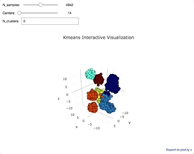

## Simple Interactive Kmeans Visualization
[Notebook](notebooks/kmeans_viz.ipynb)

**Creating 2D and 3D interactive Kmeans scatter plots using plotly, ipywidgets and scikit-learn's Kmeans algorithm. Use widgets to update number of samples and centers in data generation, and number of clusters for algorithm.**




### Setup:</b>

To create a conda environment with requirements:

```conda env create -f=/path/to/requirements.txt -n <name_of_env>```</b>

```source activate <name_of_env>```</b>

```jupyter notebook```
